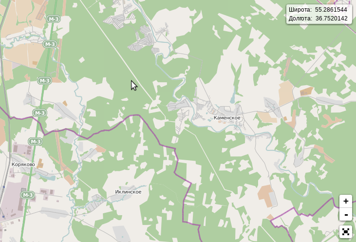

# Leaflet.mouseposition [![NPM version][npm-image]][npm-url] [![Dependency Status][depstat-image]][depstat-url]

Provides element that displayed geographic coordinates under mouse cursor.

*Requires Leaflet ~0.7.3*

You can download Leaflet 0.7 from [here](https://github.com/Leaflet/Leaflet.markercluster/tree/leaflet-0.7).

[npm-url]: https://www.npmjs.com/package/sg.leaflet.mouseposition
[npm-image]: https://badge.fury.io/js/sg.leaflet.mouseposition.svg
[depstat-url]: https://david-dm.org/sorx00/leaflet.mouseposition
[depstat-image]: https://david-dm.org/sorx00/leaflet.mouseposition.svg
